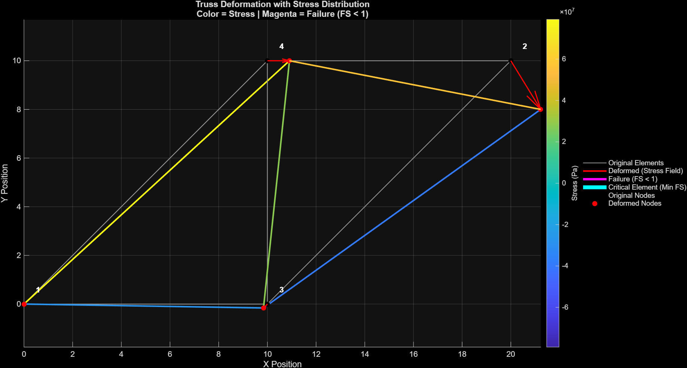
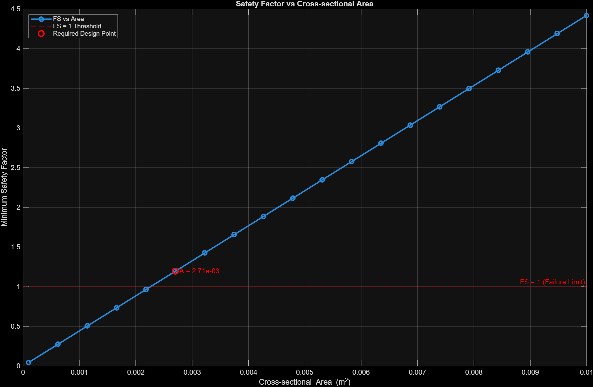
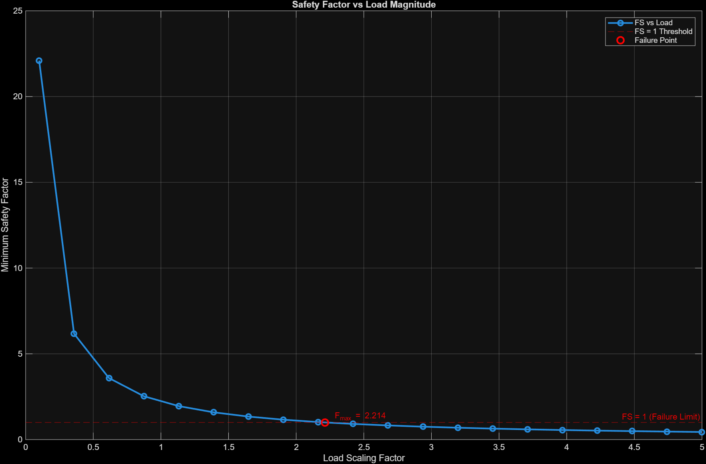

# 2D Structural Finite Element Solver (MATLAB)

## Overview
This project implements a modular 2D finite element analysis (FEA) solver for truss structures in MATLAB. The solver computes nodal displacements, internal forces, stresses, and safety factors, and supports parametric studies for structural design evaluation.

The implementation follows the direct stiffness method and has been validated against analytical solutions for simple truss configurations.

This project demonstrates:
- numerical implementation of finite element methods  
- structured solver architecture  
- engineering interpretation of structural behavior and failure  

---

## Governing Equation

The global system of equations is:

Ku = F

Where:
- K = global stiffness matrix  
- u = nodal displacement vector  
- F = applied force vector  

Each element contributes to the global stiffness matrix through coordinate-transformed local stiffness matrices, assembled using a scatter-add approach.

---

## Solver Workflow

1. Define geometry, material properties, and loading conditions  
2. Compute element stiffness matrices in local coordinates  
3. Transform element stiffness matrices to global coordinates  
4. Assemble the global stiffness matrix K  
5. Apply boundary conditions (supports and constraints)  
6. Solve Ku = F for nodal displacements  
7. Compute element forces and stresses  
8. Evaluate safety factors and identify critical members  
9. Visualize deformed structure and stress distribution  

---

## Features

- Modular solver architecture (preprocessing, solution, post-processing)  
- Global stiffness matrix assembly using element DOF mapping  
- Boundary condition enforcement for constrained DOFs  
- Nodal displacement solution via linear system solve  
- Element force and stress computation  
- Safety factor evaluation and critical member identification  
- Stress visualization (tension vs compression)  

### Parametric Studies
- Cross-sectional area vs safety factor  
- Load magnitude vs safety factor  

---

## Assumptions

- Linear elastic material behavior  
- Small deformations (geometric linearity)  
- Axial-only truss elements (no bending or shear)  
- Static loading conditions  

---

## Results

### Stress Distribution

- Red = tension  
- Blue = compression  
- Critical members identified via minimum safety factor  

---

### Area Parametric Study

Safety factor increases linearly with cross-sectional area.

Key relationship:  
σ = N / A  
→ Safety Factor ∝ A  

**Insight:** Increasing cross-sectional area directly improves structural safety.

---

### Load Parametric Study

Safety factor decreases as applied load increases.

The structure reaches failure at approximately:

**Maximum load factor ≈ 2.2× original load**

Key relationship:  
Safety Factor ∝ 1 / Load  

**Insight:** The structure can safely carry approximately 2.2× the original load before reaching failure, defining its maximum load capacity.

---

## Validation

The solver was validated against analytical solutions for simple truss configurations.

- Member forces matched analytical results within small numerical error  
- Reaction forces satisfied global equilibrium  
- Nodal displacements were consistent with closed-form solutions  

These checks verify correctness of stiffness assembly, boundary condition implementation, and solution accuracy.

---

## Project Structure

runTrussSolver.m — Main execution script  

defineProblem.m — Geometry, material properties, and loading  
buildSystem.m — Global stiffness matrix assembly  
solveTruss.m — System solution (Ku = F)  
computeReactions.m — Reaction force calculation  
postProcess.m — Element force and stress computation  
computeSafetyFactor.m — Safety factor evaluation  
plotTruss.m — Visualization of structure and results  
printResults.m — Output formatting  

parametricAreaStudy.m — Area sensitivity analysis  
parametricLoadStudy.m — Load capacity analysis  

images/ — Result visualizations  

---

## Limitations and Future Work

### Current Limitations
- Dense matrix implementation (not optimized for large-scale systems)  
- Linear material and geometric assumptions  
- Truss-only elements (no bending or rotational DOFs)  

### Future Improvements
- Sparse matrix implementation for improved computational efficiency  
- Extension to 3D truss and frame elements  
- Inclusion of beam bending and rotational DOFs  
- Nonlinear material and geometric analysis  
- Dynamic loading and time-dependent analysis  

---

## Summary

This project implements a complete structural analysis pipeline:

1. Model definition  
2. Finite element solution  
3. Stress and safety evaluation  
4. Design exploration through parametric studies  

It demonstrates both numerical implementation of FEA methods and practical engineering insight into structural performance and failure.
